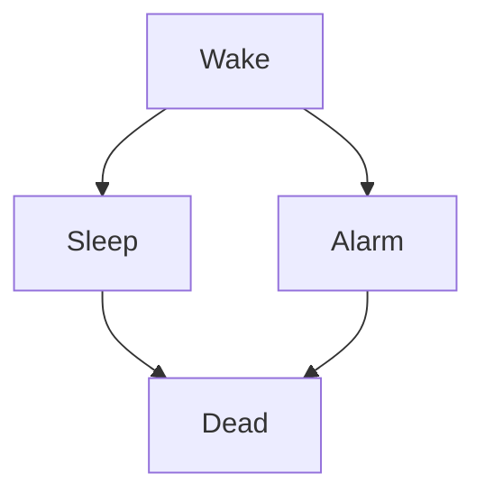
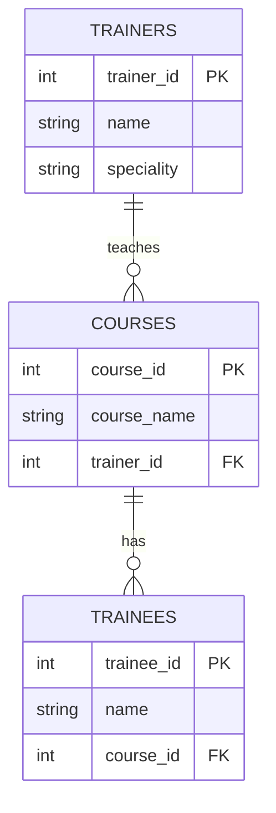

Hello, this is plain text

# H1

## H2 Header

### H3 Header

###### H6 header

## Stylings

*Italics*

_this is also italics_

**Bold**

__this is also bold__

__*bold* but with onlt partly italic__


> Et tu,  Brute?
> > Julius Caesar
> > > W. Shakespeare


> #### NOTE
>
> Tell trainees to download the latest VS code extension at this point in the lesson

## Lists

- this 
- that
- the other
<br>
* first
* second 
* third


1. One
1. Two
1. Three

<br>

1. Nish
   - C#
2. Cathy
   - Java
   - C#

# Links

<!-- 


For more information about markdown see [here](https://github.com/adam-p/markdown-here/wiki/markdown-cheatsheet) -->

- [H1](#h1)
  - [H2 Header](#h2-header)
    - [H3 Header](#h3-header)
          - [H6 header](#h6-header)
  - [Stylings](#stylings)
  - [Lists](#lists)
- [Links](#links)
  - [GitHub flavoured markdown](#github-flavoured-markdown)
  - [Task lists](#task-lists)
  - [Tables](#tables)
  - [Mermaid](#mermaid)


## GitHub flavoured markdown

My `CustomerService` class uses the `CustomerReposiory` for it's constructor injection

```sql
SELECT * CUSTOMERS
```

```java
public static void main(String[] args){
    System.out.println("Hell, world");
}
```

```csharp
public static void Main(){
    Console.WriteLine("Hello, world");
}
```

## Task lists

- [ ] Sleep
- [x] Eat


## Tables

| Name | Street | Town |
|------|--------|------|
|Nish|Walmley St.| Brum|
|Cathy| 123 St| Stafford

| Name  | Street  | Town                               |
| ----- | ------- | ---------------------------------- |
| Nish  | Walmley | Brum                               |
| Cathy | 123 st  | Stafford                           |
| Phil  | ABC rd  | London |


Here’s a clear, copy-paste-ready table with the key details of **The Beatles**:

| Member              | Role(s)               | Birth Name           | Date of Birth | Place of Birth     | Notable Contributions                                           |
| ------------------- | --------------------- | -------------------- | ------------- | ------------------ | --------------------------------------------------------------- |
| **John Lennon**     | Rhythm guitar, vocals | John Winston Lennon  | 9 Oct 1940    | Liverpool, England | Sharp lyricist, co-founder, experimental edge, political themes |
| **Paul McCartney**  | Bass, vocals, piano   | James Paul McCartney | 18 Jun 1942   | Liverpool, England | Melodic songwriting, wide vocal range, musical versatility      |
| **George Harrison** | Lead guitar, vocals   | George Harrison      | 25 Feb 1943   | Liverpool, England | Distinctive guitar work, Indian musical influence               |
| **Ringo Starr**     | Drums, vocals         | Richard Starkey      | 7 Jul 1940    | Liverpool, England | Solid, musical drumming style, distinctive personality          |

If you want, I can add **albums**, **key songs**, or a **timeline** version.


## Mermaid



<br>
<br>


